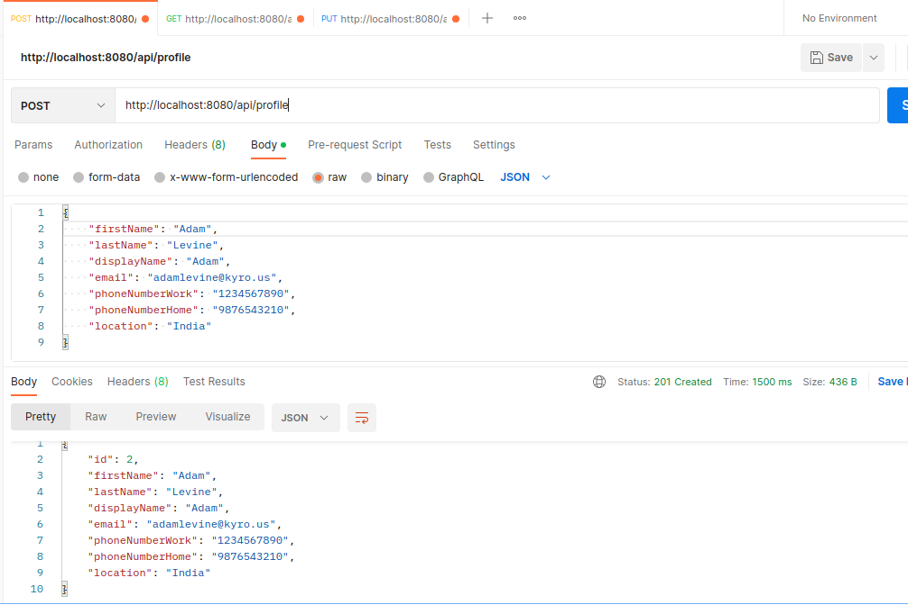
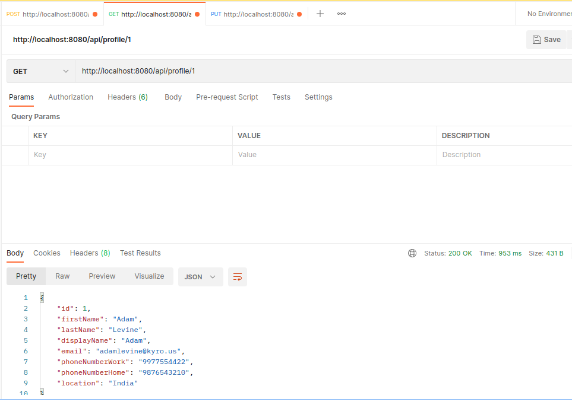

## Basic Spring App with Postgres

A basic springboot application that can be used to create, view, update new profiles for a web app.

### Requirements:

- IntelliJ
- Java 8
- Springboot 2.7
- maven
- Postgres
- git
- postman

### Postgres Table Schema

```shell
CREATE TABLE public.profiles(
        id serial PRIMARY KEY,
        firstname text NOT NULL,
        lastname text,
        displayname text NOT NULL,
        email text NOT NULL,
        worknumber text NOT NULL,
        homenumber text,
        location text NOT NULL
    );
```

### How to run

1. clone this repo:

```shell
git clone https://github.com/MvkZ/profile-springboot-app.git
```

2. switch to develop branch

```shell
git checkout develop
```

3. run using maven command after checking if the database and table names are right

```shell
mvn spring-boot:run
```

4. Now you can use Postman with the following API to test.

> Creating a Profile - POST => http://localhost:8080/api/profiles

> View a Profile - GET => http://localhost:8080/api/profile/{id}

> Update a Profile - PUT => http://localhost:8080/api/profile/{id}

### Screenshots

- Creating a Profile



- Update a Profile


- View a Profile



### TODO

- add other CRUD operations for the application
- update schema (for example. mobile number)
- dockerize it with the frontend app
